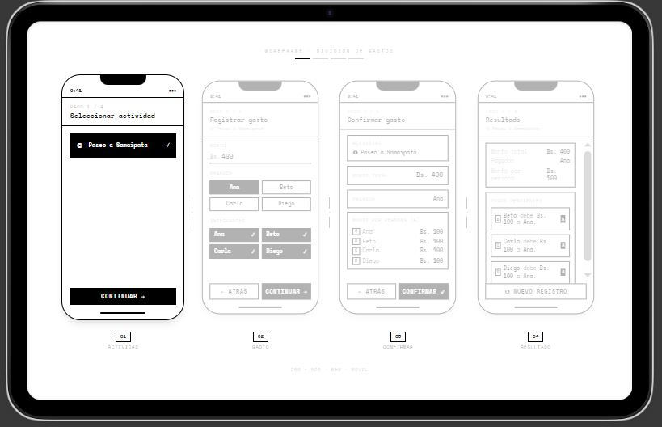

# Wireframe del flujo 1: Registrar un gasto

Wireframe en escala de grises que representa el flujo para registrar y dividir un gasto compartido.

## Pantallas

1. Seleccionar una actividad.
2. Registrar el gasto.
3. Confirmar los datos del gasto.
4. Ver el resultado y los saldos pendientes.

