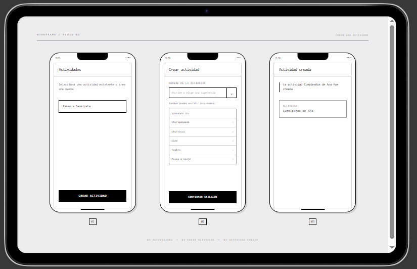

# Wireframe del flujo 2: Crear una actividad

Wireframe en escala de grises que representa el flujo para crear una nueva actividad.

## Pantallas

1. Seleccionar la opción Crear actividad.
2. Elegir una sugerencia o escribir el nombre de la actividad.
3. Confirmar y ver la actividad creada.

## Decisión de diseño

El campo permite seleccionar una actividad sugerida o escribir un nombre diferente. El nombre creado se muestra como información y no como un botón.

## Actualización Clase 5

Se completaron manualmente en Figma las pantallas pendientes del flujo 2 aplicando jerarquía, layout y espaciado.

- `f2-02-crear-actividad-clase5.png`: pantalla para ingresar el nombre de la actividad y confirmar la creación.
- `f2-03-actividad-creada-clase5.png`: pantalla de confirmación con el nombre de la actividad creada.
